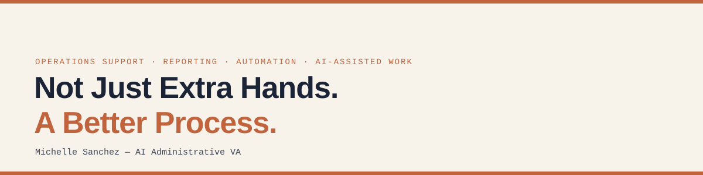

### Less scattered work. Clearer data. Smoother processes. Smarter support with automation and AI.

6 years of freelance support work: administrative, reporting, and workflow automation.

---

## About

Growing businesses often spend too much time on repetitive administrative work, manual reporting, disconnected spreadsheets, and processes that slow teams down. This portfolio shows real work built to fix exactly that.

---

## Explore My Work

**Click a category below to explore complete projects, case studies, screenshots, workflows, and business solutions.**

### 🔁 [Business Automation](https://github.com/mitchsanchez29/business-automation)
Automate repetitive workflows, connect business tools, and streamline operations to reduce manual work and improve efficiency.

### 📊 [Reporting & Analytics](https://github.com/mitchsanchez29/reporting-analytics)
Transform business data into dashboards and reporting systems that provide clear insights for faster, data-driven decisions.

### 💰 [Finance & Operations](https://github.com/mitchsanchez29/finance-operations)
Improve financial visibility through organized payment tracking, accounts receivable systems, and operational reporting.

---

## Available For

- Administrative and Operation support
- Reporting & dashboard development
- Finance & accounts receivable support
- Research & outreach
- Inbox & document organization
- Workflow automation (Google workspace, Zapier)
- API integration & automated reporting

---

## How It Works

**Business Work, Handled.**

1. **Send a Message** — Describe the problem or the task that needs support.
2. **Get a Response** — A reply within 24 hours (Philippines, GMT+8).
3. **See the Scope** — Scope and timeline shared before any work starts.

[Send The First Message →](mailto:sanchezmitch77@gmail.com)

---

## Contact

---

*"Give thanks in all circumstances." — 1 Thess. 5:18*

